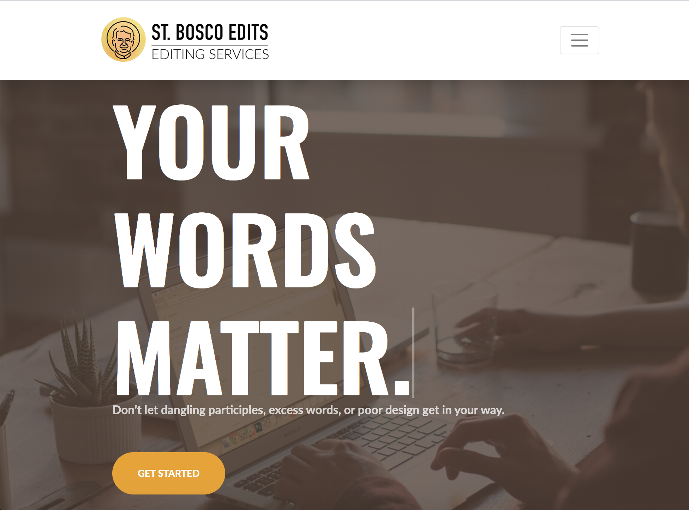

# St Bosco Edits

(stboscoedits.com)

### a single page responsive website for a local copyediting business using bootstrap and jQuery.

## GOALS

- Move the site off of wordpress and make it responsive
- Redesign the UI
- Include smoothscrolling & a quote slider

## DESIGN

I wanted a catchy hero style masthead with big fonts. We went the Oswald font for our headings. The main brand color is a soft yellow, and we used a similar tone for the masthead photo overlay. The white heading complemented nicely with the soft yellow.

I created a typing effect using javascript and CSS for the hero, which fit well with the copyediting + copywriting theme.

One of my big early challenges as a new developer was figureing out how to use two logos in the header (one black, one white) when the header dropdown triggers.

## TECH STACK

I used this project as a way to help me learn Bootstrap. It was my first Bootstrap website and so I used a template called [Creative](https://startbootstrap.com/themes/creative/). I also played around with [AOS Animation](https://michalsnik.github.io/aos/) for on scroll animations but I ultimately preferred the site and UX without the animation.

The original template used jQuery for smooth-scrolling and the nav dropdown effect. I didn't have much experience with jQuery, but it was easy to catch on quickly.

This was also an opportunity to learn Netlify, where the site currently lives.

## RUN LOCALLY

clone using https://github.com/mattdm3/stboscoV2.git

## SCREENSHOTS

